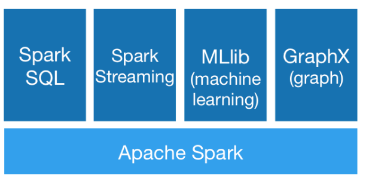

# Apache Spark Ecosystem

**Apache Spark™** is a unified analytics engine for large-scale data processing developed at UC Berkeley in 2009.  It has received rapid acceptance from a wide range of industries, especially those that process at massive scale.  Apache Spark can process multiple petabytes of data residing on over 8,000 nodes.  It is  an open source project supported by over 1000 contributors from over 250 organizations.

## Slides

[slides - pdf](https://github.com/marilynwaldman/course/blob/master/spark/00-Introduction/00-Introduction.pdf)

[slides - pptx](https://github.com/marilynwaldman/course/blob/master/spark/00-Introduction/00-Introduction.pptx)

### Apache Spark is known for:

* **Speed**

  Run workloads 100x faster.  Apache Spark achieves high performance for both batch and streaming data, using a state-of-the-art DAG scheduler, a query optimizer, and a physical execution engine.

* **Ease of Use**

  Write applications quickly in Java, Scala, Python, R, and SQL.

* **Generality**

  Combines SQL, streaming, and complex analytics.  Spark powers a stack of libraries including [SQL and DataFrames](https://spark.apache.org/sql/), [MLlib](https://spark.apache.org/mllib/) for machine learning, [GraphX](https://spark.apache.org/graphx/), and [Spark Streaming](https://spark.apache.org/streaming/). You can combine these libraries seamlessly in the same application.

* **Runs Everywhere**

  Spark runs on Hadoop, Apache Mesos, Kubernetes, standalone, or in the cloud. It can access diverse data sources.

  You can run Spark using its [standalone cluster mode](https://spark.apache.org/docs/latest/spark-standalone.html), on [EC2](https://github.com/amplab/spark-ec2), on [Hadoop YARN](https://hadoop.apache.org/docs/current/hadoop-yarn/hadoop-yarn-site/YARN.html), on [Mesos](https://mesos.apache.org/), or on [Kubernetes](https://kubernetes.io/). Access data in [HDFS](https://hadoop.apache.org/docs/stable/hadoop-project-dist/hadoop-hdfs/HdfsUserGuide.html), [Alluxio](https://alluxio.org/), [Apache Cassandra](https://cassandra.apache.org/), [Apache HBase](https://hbase.apache.org/), [Apache Hive](https://hive.apache.org/), and hundreds of other data sources.

[Credit : Apache Spark](https://spark.apache.org/)

####  

  
 

