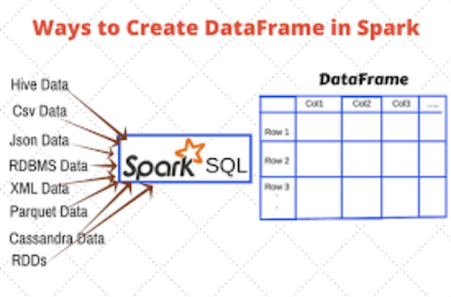

# Spark DataFrames

## Introduction

A DataFrame is a _Dataset_ organized into named columns. It is conceptually equivalent to a table in a relational database or a data frame in R/Python, but with richer optimizations under the hood.

### Objectives

* Getting Started
* Creating DataFrames
* Types and Operations on DataFrames
* Interoperability with RDDS
* Aggregations
* Data Sources

### Creating DataFrames

* [slides](https://github.com/marilynwaldman/course/blob/master/spark/07-DataFrames/02-CreateDataFrames%20.pdf)
* [notebook](https://github.com/marilynwaldman/course/blob/master/spark/07-DataFrames/02-CreateDataFrames.ipynb)

### Types and Operations on DataFrames

* [slides](https://github.com/marilynwaldman/course/blob/master/spark/07-DataFrames/04-TypesAndOperations.pdf)
* [notebook](https://github.com/marilynwaldman/course/blob/master/spark/07-DataFrames/04-TypesAnOperations.ipynb)

### OrderBy, Aggregations and Join

* [slides](https://github.com/marilynwaldman/course/blob/master/spark/07-DataFrames/06-OrderBy-Agg-Join.pdf)
* [notebook](https://github.com/marilynwaldman/course/blob/master/spark/07-DataFrames/06-OrderBy-Agg-Join.ipynb)

#### GroupBy

* [slides](https://github.com/marilynwaldman/course/blob/master/spark/07-DataFrames/10-GroupBy.pdf)
* [notebook](https://github.com/marilynwaldman/course/blob/master/spark/07-DataFrames/10-GroupBy.ipynb)

### Datasets and DataFrames 

A Dataset is a distributed collection of data. Dataset is a new interface added in Spark 1.6 that provides the benefits of RDDs \(strong typing, ability to use powerful lambda functions\) with the benefits of Spark SQL’s optimized execution engine. A Dataset can be [constructed](https://spark.apache.org/docs/2.3.0/sql-programming-guide.html#creating-datasets) from JVM objects and then manipulated using functional transformations \(`map`, `flatMap`, `filter`, etc.\). The Dataset API is available in [Scala](https://spark.apache.org/docs/2.3.0/api/scala/index.html#org.apache.spark.sql.Dataset) and [Java](https://spark.apache.org/docs/2.3.0/api/java/index.html?org/apache/spark/sql/Dataset.html). Python does not have the support for the Dataset API. But due to Python’s dynamic nature, many of the benefits of the Dataset API are already available \(i.e. you can access the field of a row by name naturally `row.columnName`\). The case for R is similar.

A DataFrame is a _Dataset_ organized into named columns. It is conceptually equivalent to a table in a relational database or a data frame in R/Python, but with richer optimizations under the hood. DataFrames can be constructed from a wide array of [sources](https://spark.apache.org/docs/2.3.0/sql-programming-guide.html#data-sources) such as: structured data files, tables in Hive, external databases, or existing RDDs. The DataFrame API is available in Scala, Java, [Python](https://spark.apache.org/docs/2.3.0/api/python/pyspark.sql.html#pyspark.sql.DataFrame), and [R](https://spark.apache.org/docs/2.3.0/api/R/index.html). In Scala and Java, a DataFrame is represented by a Dataset of `Row`s. In [the Scala API](https://spark.apache.org/docs/2.3.0/api/scala/index.html#org.apache.spark.sql.Dataset), `DataFrame` is simply a type alias of `Dataset[Row]`. While, in [Java API](https://spark.apache.org/docs/2.3.0/api/java/index.html?org/apache/spark/sql/Dataset.html), users need to use `Dataset<Row>` to represent a `DataFrame`.  

