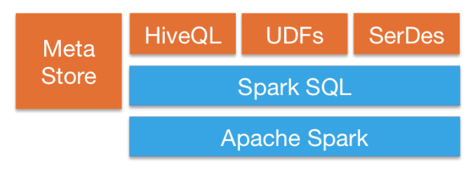

# Spark SQL

## Introduction

### Slides and Notebook

* [slides](https://github.com/marilynwaldman/course/blob/master/spark/05-SparkSQL/01-IngestSparkSQL.pdf)
* [notebook](https://github.com/marilynwaldman/course/blob/master/spark/05-SparkSQL/01-IngestSparkSQL.ipynb)

### **Spark SQL** is Apache Spark's module for working with structured data.

* **Integrated**

  Seamlessly mix SQL queries with Spark programs.

  Spark SQL lets you query structured data inside Spark programs, using either SQL or a familiar [DataFrame API](https://spark.apache.org/docs/latest/sql-programming-guide.html). Usable in Java, Scala, Python and R.

* **Uniform Data Access**

  Connect to any data source the same way.  DataFrames and SQL provide a common way to access a variety of data sources, including Hive, Avro, Parquet, ORC, JSON, and JDBC. You can even join data across these sources.

* **Hive Integration**

  Run SQL or HiveQL queries on existing warehouses.

  Spark SQL supports the HiveQL syntax as well as Hive SerDes and UDFs, allowing you to access existing Hive warehouses.

* **Standard Connectivity**

  Connect through JDBC or ODBC.

  A server mode provides industry standard JDBC and ODBC connectivity for business intelligence tools.

* [credit: Apache Spark](https://spark.apache.org/sql/)

