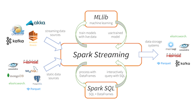

# Spark Streaming

## Introduction

**Spark Streaming** makes it easy to build scalable fault-tolerant streaming applications.

### **Objectives**

* Getting Started 
* Dstreams
* Windows
* Limitations - late data, sessions
* Structured Streaming

### Slides

[slides](https://github.com/marilynwaldman/course/blob/master/spark/09-SparkStreaming/00-Stream-Introdction.pdf)

