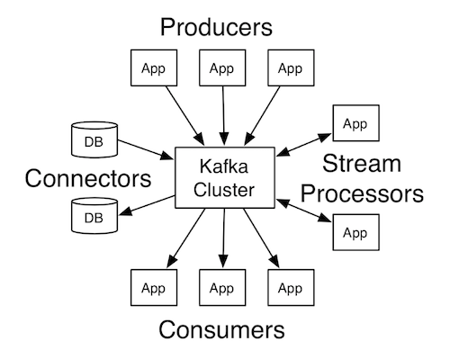

# Apache Kafka

### slides

[slides](https://github.com/marilynwaldman/course/blob/master/Kafka/00-Introduction.pdf)

## Introduction

#### Apache Kafka® is a distributed streaming platform. What exactly does that mean?

A streaming platform has three key capabilities:

* Publish and subscribe to streams of records, similar to a message queue or enterprise messaging system.
* Store streams of records in a fault-tolerant durable way.
* Process streams of records as they occur.

Kafka is generally used for two broad classes of applications:

* Building real-time streaming data pipelines that reliably get data between systems or applications
* Building real-time streaming applications that transform or react to the streams of data

[credit : Apache Kafka](https://kafka.apache.org/intro)

