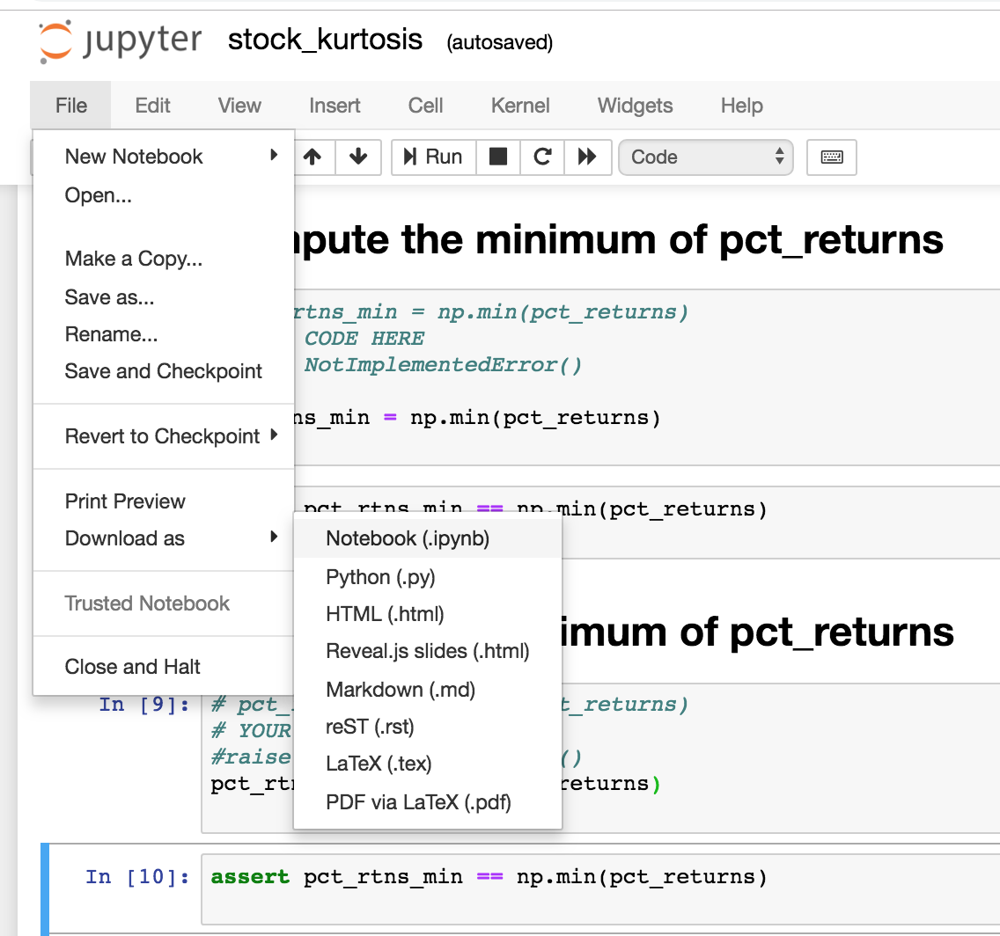

# Autograder

## Introduction

This course uses an autograder for grading your assignments.  This exercise demonstrates how to

1. Download your assignment to your VM
2. Answer the exercises
3. Upload your answers to the autograder

## Exercise

### Open a terminal on your native machine and start Vagrant

```text
cd msbx5420vagrant
vagrant halt
vagrant up
```

### Download the exercise from GitHub

```text
cd
cd work
rm -rf autograder
rm -rf MSBX5420-001-FunctionalProgramming
git clone https://github.com/marilynwaldman/autograder.git
```

### Stop remove all containers - you will see errors if you have no containers running

```text
docker kill $(docker ps -q)
docker rm $(docker ps -a -q)
```

### Start your Spark Notebook

```text
docker run -d --name spark  -p 8888:8888  \
    -v $HOME/work:/home/jovyan/work:rw  \
     jupyter/all-spark-notebook \
     start-notebook.sh --NotebookApp.token='' 
```

### Open your browser and go to:

```text
http://localhost:8888
```

### Pull up the exercise in the "autograder" folder


### Answer the question at the end of the notebook

Note that you must comment out the "raise NotImplementedError\(\) and insert your answer


### Download the notebook and submit to Canvas

Note:

* The notebook Downloads to you native machine. 
* The name of the file to be submitted to the autograder must be "stock\_kurtosis.ipynb", exactly the name when downloaded from GitHub.
* The cells are graded per the "assert" section.  Use care when modifying graded cells

 



### Stop all docker containers on the VM

```text
docker stop spark
docker rm spark
```

### Shut down the VM - from the native machine

```text
vagrant halt
```

