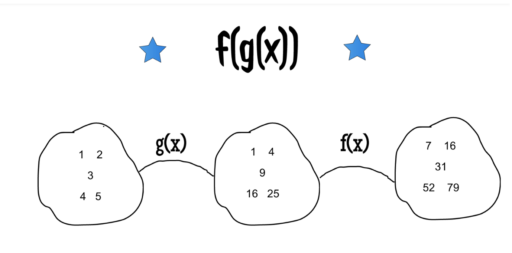

# Functional Programming

* [Introduction](https://github.com/marilynwaldman/course/blob/master/Functional%20Programming%20/01-LambdaExpressions.ipynb)
* [Map](https://github.com/marilynwaldman/course/blob/master/Functional%20Programming%20/02-FunctionalProgramming%20-%20Map%20.ipynb)
* [Reduce](https://github.com/marilynwaldman/course/blob/master/Functional%20Programming%20/03-FunctionalProgramming%20-%20Filter.ipynb)
* [Filter](https://github.com/marilynwaldman/course/blob/master/Functional%20Programming%20/04_FunctionalProgramming%20-%20Reduce.ipynb)

