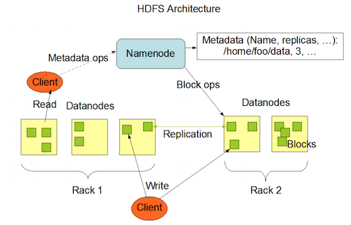

# HDFS

## Introduction

> The Hadoop Distributed File System \(HDFS\) is a distributed file system designed to run on commodity hardware. It has many similarities with existing distributed file systems. However, the differences from other distributed file systems are significant. HDFS is highly fault-tolerant and is designed to be deployed on low-cost hardware. HDFS provides high throughput access to application data and is suitable for applications that have large data sets. HDFS relaxes a few POSIX requirements to enable streaming access to file system data. HDFS was originally built as infrastructure for the Apache Nutch web search engine project. HDFS is now an Apache Hadoop subproject. The project URL is [http://hadoop.apache.org/hdfs/](http://hadoop.apache.org/hdfs/).

## Slides

[slides](https://github.com/marilynwaldman/course/blob/master/Hadoop/03-HDFS.pdf)

