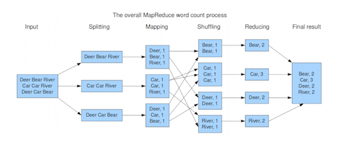
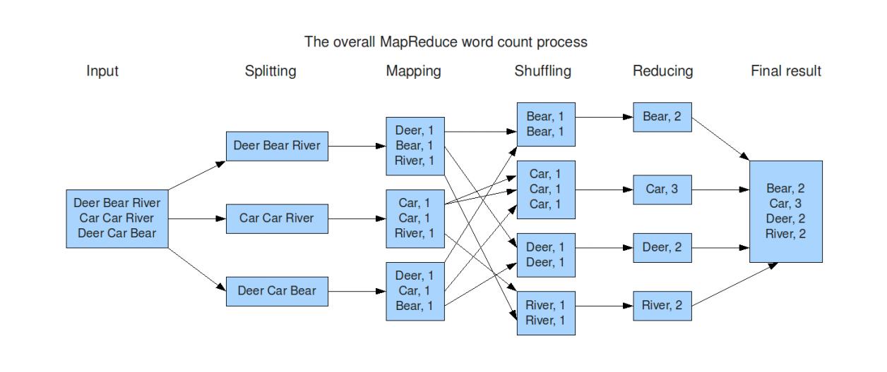

# MapReduce

## Introduction

> "MapReduce
 is 
a 
software 
framework 
for 
processing
\(large1\) 
data
sets 
in 
a
 distributed
 fashion
 over 

several
machines.  

The 
core 
idea
 behind
 MapReduce 
is
 mapping
 your 
data
set 
into 
a 
collection 
of 

pairs 
and 
then 
reducing
 over
 all 
pairs
with 
the 
same
 key."

[Diana 
MacLean 
for 
CS448G,
2011](https://hci.stanford.edu/courses/cs448g/a2/files/map_reduce_tutorial.pdf)

### Use Cases

* Distributed
   sort 
* Distributed
   search 
* Web‐link 
  graph
   traversal 
* Machine 
  learning

### Workflow

