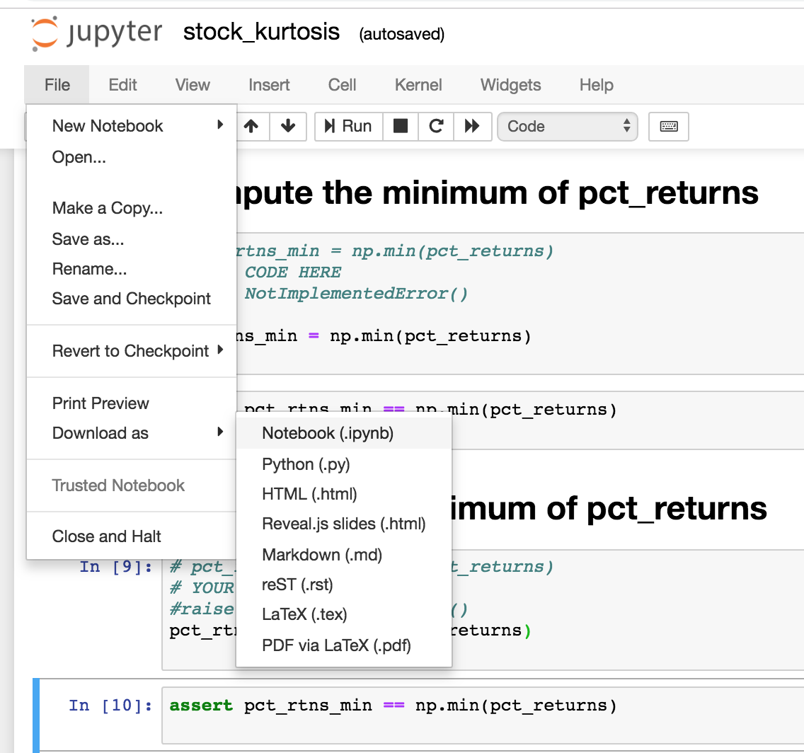

# Week 3

## Notebooks are here:

[notebooks](https://github.com/marilynwaldman/week3)

## Slides

[slides - pdf](https://github.com/marilynwaldman/course/blob/master/Homework/Week3/01_week3.pdf)

[slides -pptx](https://github.com/marilynwaldman/course/blob/master/Homework/Week3/01_week3.pptx)

## Introduction

This assignment has three notebooks that you will turn in:

1. Computing probability moments using Python iteration methods
2. Computing probability moments with functional programming in Python
3. Computing probability moments with Spark Rdds

The meaning of the four probability moments is described[ here](http://www.aip.de/groups/soe/local/numres/bookcpdf/c14-1.pdf).

## Exercise

### Open a terminal on your native machine and start Vagrant

```text
cd msbx5420vagrant
vagrant halt
vagrant up
```

### Download the exercise from GitHub

```text
cd
cd work
rm -rf week3
git clone https://github.com/marilynwaldman/week3.git
```

### Stop remove all containers - you will see errors if you have no containers running

```text
docker kill $(docker ps -q)
docker rm $(docker ps -a -q)
```

### Start your Spark Notebook

```text
docker run -d --name spark  -p 8888:8888  \
    -v $HOME/work:/home/jovyan/work:rw  \
     jupyter/all-spark-notebook \
     start-notebook.sh --NotebookApp.token='' 
```

### Open your browser and go to:

```text
http://localhost:8888
```

### Pull up the exercises in the "week3" folder

### Download the notebooks and submit to Canvas

Note:

* The notebook Downloads to you native machine. 
* The name of the file to be submitted to the autograder must be  exactly the name when downloaded from GitHub.
* The cells are graded per the "assert" section.  Use care when modifying graded cells

 



### Stop all docker containers on the VM

```text
docker stop spark
docker rm spark
```

### Shut down the VM - from the native machine

```text
vagrant halt
```

