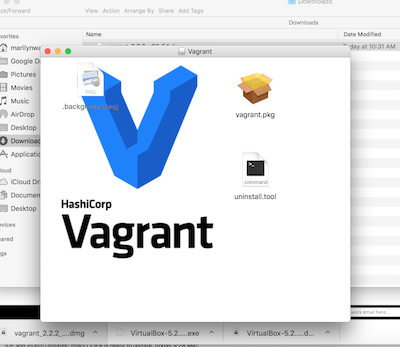
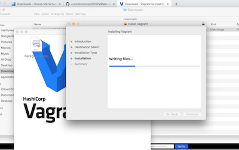

# Install Vagrant on Mac

## Open a browser window and go to:  [Download Vagrant](https://www.vagrantup.com/downloads.html)

* Download Vagrant

  

  * Go to you Downloads directory from Finder

    

  * Drag to Apps
  * Double click and Run

    

  * Installation

    

* Installation Type

  

* Enter your password

  

* Click success and move to trash

  

