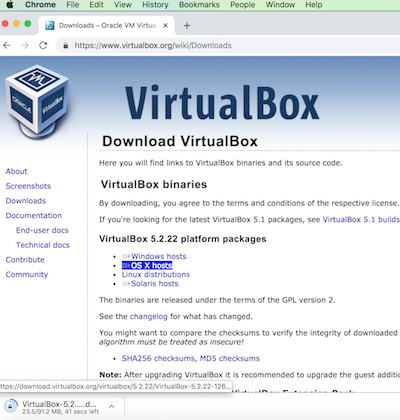
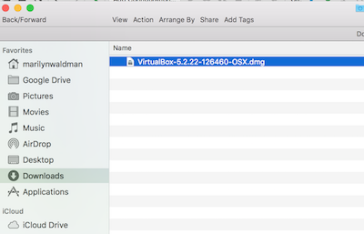
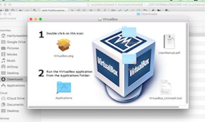
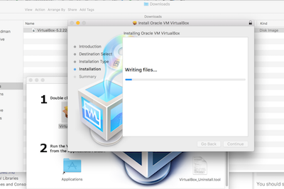
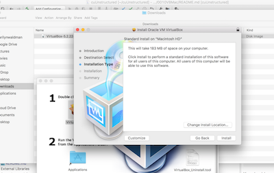
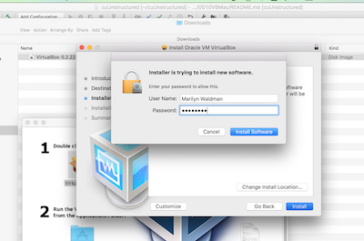
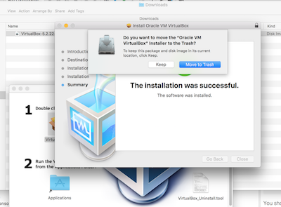

# Install VirtualBox on Mac

> Install VirtualBox and Vagrant on MAC OS

## Download and Install VirtualBox

### Open a browser window and go to:  [Download VirtualBox](https://www.virtualbox.org/wiki/Downloads)

* Download VirtualBox

  

* Go to you Downloads directory from Finder

  

* Drag to Apps
* Double click and Run

  

* Installation

  

* Installation Type

  

* Enter your password

  

* Click move to trash

  

