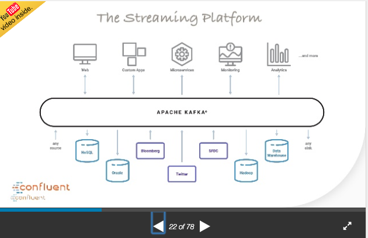
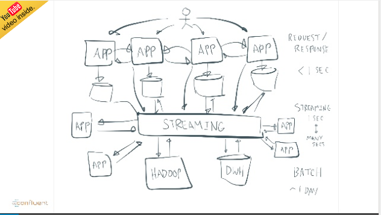
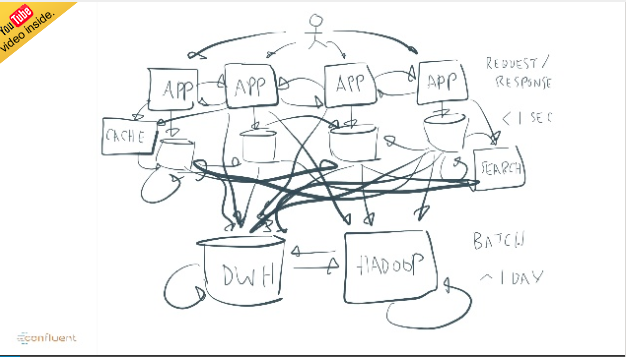
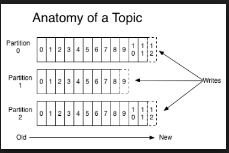
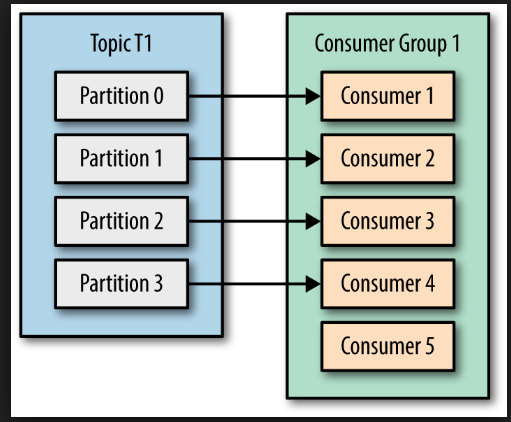

# Kafka Introduction

### Introduction

* Pub/Sub
* Used for near realtime processing - events
* Kafka began at LinkedIn - Jay Krep - I Love Logs - also Amazon Kinesis
* Solves 3 problems - unreliable receivers, scaling, messy communications

#### Why event driven

* compare to batch
* fraud detection
* IOT
* show architecture of stuff

#### What is Pub/Sub

* Producer/Consumer with a buffer
* Events are numbered and processed in order

#### Architecture

####  Solves the Messy Communications Problem

#### Scaling

  

