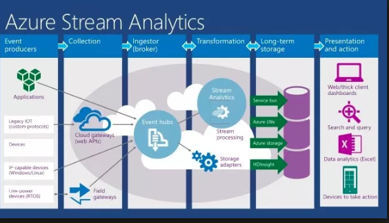
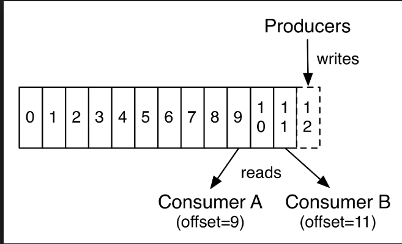

# Kafka Introduction

### Introduction

* Pub/Sub
* Used for near realtime processing - events
* Kafka began at LinkedIn - Jay Krep - I Love Logs - also Amazon Kinesis
* Solves 2 problems - unreliable receivers and scaling

#### Why event driven

* compare to batch
* fraud detection
* IOT
* show architecture of stuff

#### What is Pub/Sub

* Producer/Consumer with a buffer
* Events are numbered and processed in order

