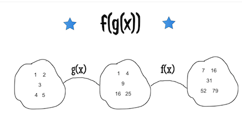

# Functional Programming

## Introduction

In [computer science](https://en.wikipedia.org/wiki/Computer_science), **functional programming** is a [programming paradigm](https://en.wikipedia.org/wiki/Programming_paradigm)—a style of building the structure and elements of [computer programs](https://en.wikipedia.org/wiki/Computer_program)—that treats [computation](https://en.wikipedia.org/wiki/Computation) as the evaluation of [mathematical functions](https://en.wikipedia.org/wiki/Function_%28mathematics%29) and avoids changing-[state](https://en.wikipedia.org/wiki/Program_state) and [mutable](https://en.wikipedia.org/wiki/Immutable_object) data. It is a [declarative programming](https://en.wikipedia.org/wiki/Declarative_programming) paradigm, which means programming is done with [expressions](https://en.wikipedia.org/wiki/Expression_%28computer_science%29) or declarations[\[1\]](https://en.wikipedia.org/wiki/Functional_programming#cite_note-expression_style-1) instead of [statements](https://en.wikipedia.org/wiki/Statement_%28computer_science%29)

## Slides

* [Lambda Expressions](https://github.com/marilynwaldman/course/blob/master/Functional%20Programming%20/01-LambdaExpressions.pdf)
* [Map](https://github.com/marilynwaldman/course/blob/master/Functional%20Programming%20/02-FunctionalProgramming%20-%20Map.pdf)
* [Reduce](https://github.com/marilynwaldman/course/blob/master/Functional%20Programming%20/04-FunctionalProgramming%20-%20Reduce.pdf)
* [Filter](https://github.com/marilynwaldman/course/blob/master/Functional%20Programming%20/03-FunctionalProgramming%20-%20Filter.pdf)

### Notebooks

* [Lambda Expressions](https://github.com/marilynwaldman/course/blob/master/Functional%20Programming%20/01-LambdaExpressions.ipynb)
* [Map](https://github.com/marilynwaldman/course/blob/master/Functional%20Programming%20/02-FunctionalProgramming%20-%20Map%20.ipynb)
* [Reduce](https://github.com/marilynwaldman/course/blob/master/Functional%20Programming%20/03-FunctionalProgramming%20-%20Filter.ipynb)
* [Filter](https://github.com/marilynwaldman/course/blob/master/Functional%20Programming%20/03-FunctionalProgramming%20-%20Filter.ipynb)

[Credit : Wikipedia.](https://en.wikipedia.org/wiki/Functional_programming)

