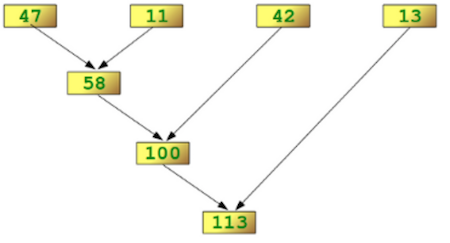

# Reduce Abstraction

## Syntax

Reduce takes a list, a binary operation, and an identity element for the operation.  It returns a list of the operator applied to successive application of the operations to intermediate results



##  Example

```text
from functools import reduce
product = reduce((lambda x, y: x * y), [1, 2, 3, 4])

# Output: 24
```

