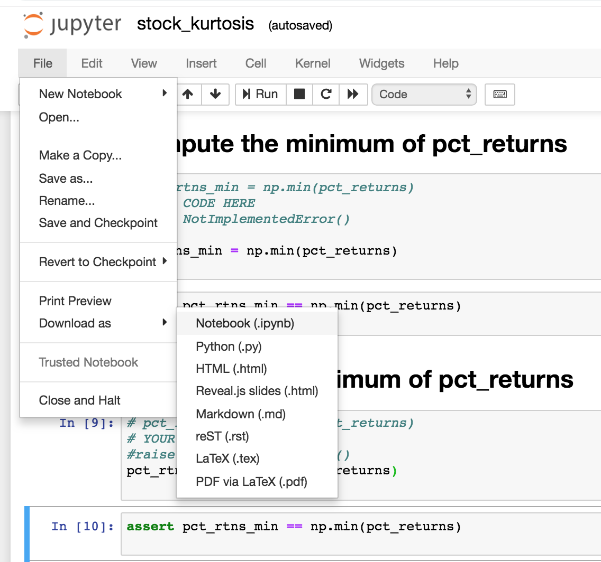

# Week 3

##  <a id="open-a-terminal-on-your-native-machine-and-start-vagrant"></a>

## Introduction

This assignment has three notebooks that you will turn in:

1. Computing probability moments using Python iteration methods
2. Computing probability moments with functional programming in Python
3. Computing probability moments with Spark Rdds

## Exercise

### Open a terminal on your native machine and start Vagrant

```text
cd msbx5420vagrant
vagrant halt
vagrant up
```

### Download the exercise from GitHub

```text
cd
cd work
rm -rf autograder
rm -rf week3
git clone https://github.com/marilynwaldman/week3.git
```

### Stop remove all containers - you will see errors if you have no containers running

```text
docker kill $(docker ps -q)
docker rm $(docker ps -a -q)
```

### Start your Spark Notebook

```text
docker run -d --name spark  -p 8888:8888  \
    -v $HOME/work:/home/jovyan/work:rw  \
     jupyter/all-spark-notebook \
     start-notebook.sh --NotebookApp.token='' 
```

### Open your browser and go to:

```text
http://localhost:8888
```

### Pull up the exercises in the "week3" folder

### Download the notebooks and submit to Canvas

Note:

* The notebook Downloads to you native machine. 
* The name of the file to be submitted to the autograder must be  exactly the name when downloaded from GitHub.
* The cells are graded per the "assert" section.  Use care when modifying graded cells

 



### Stop all docker containers on the VM

```text
docker stop spark
docker rm spark
```

### Shut down the VM - from the native machine

```text
vagrant halt
```

